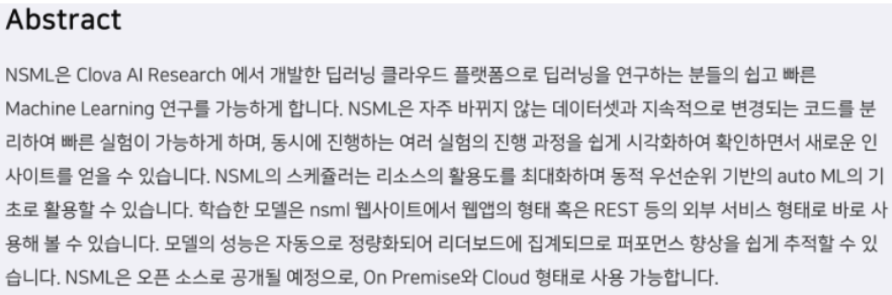
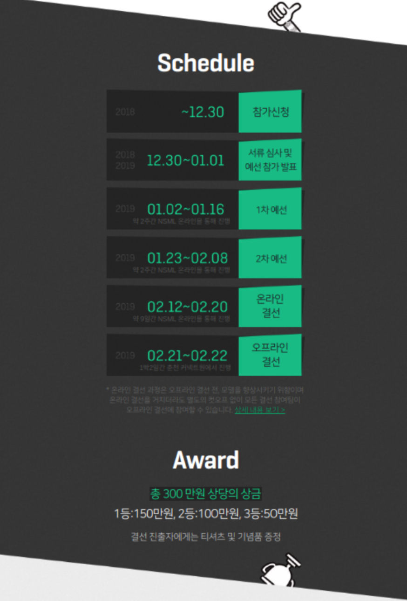
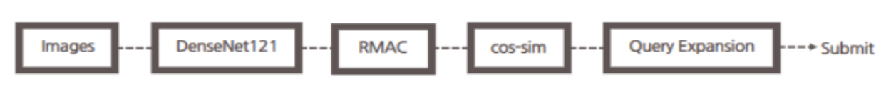
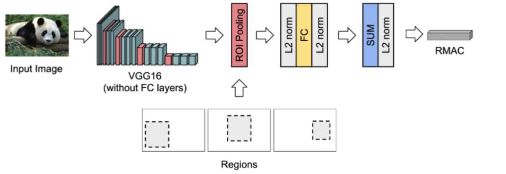
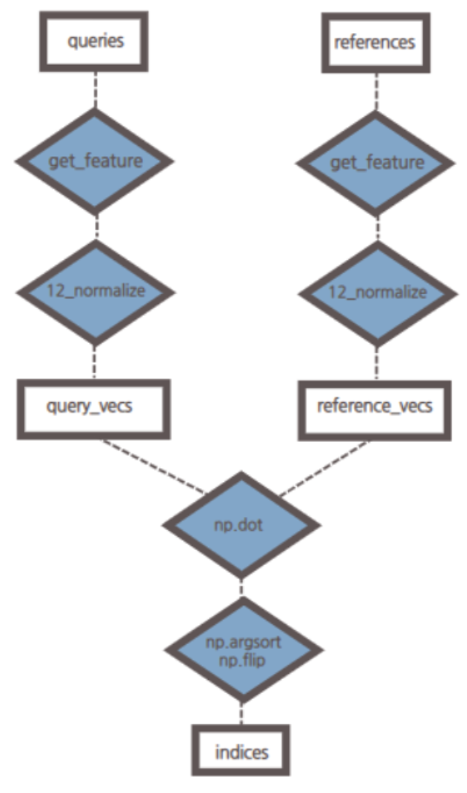

# 2018 NAVER AI Hackathon

## 대회 소개

### 대회 이름: 2018 NAVER  AI  Hackathon

- 소규모 라인프렌즈 상품 Image Retrieval (예선)
- 대규모 일반 상품 Image  Retrieval (본선)

### 사용 플랫폼: NSML

### 대회 기간 및 상금

### 팀 구성, 성적

팀명 : kh_square (3명)  
성적: 1차 예선 (43등 0.4471) 2차 예선(24등 0.5594) 오프라인 결선 진출(34등, 0.66..)

### 관련 연구

1. Google Landmark Retrieval Challenge 1st Place Summary: CVSSP & Visual Atoms(0.627)
   (<https://www.kaggle.com/c/landmark-retrieval-challenge/discussion/57855)>

2. Tolias, G., Sicre, R., & Jégou, H. Particular object retrieval with integral max-pooling of CNN activations. ICLR 2016.

3. 강의
     1. 김성훈 교수 - 모두를 위한 딥러닝 강좌
     2. udemy, Dae Bang Kim - Kearas 를 활용한 Deep Learning 입문

4. git-hub
   1. Roi pooling & R-MAC descriptor(<https://github.com/noagarcia/keras_rmac)>

---

## 모델 소개

### 1. 환경

    사용 언어: Python 3.6
    프레임 워크: Keras
    사용 플랫폼 : NSML

### 2. 모델 구성

백본 모델은 figure1과 같이 DenseNet121을 사용하였습니다. 여러 다른 모델들 중에서  가장 좋은 성능을 보였고, NSML에 직접 업로드 할 수 있는 pretrained weight 용량이 제한적이었는데, DenseNet121의 pretrained weight 파일은 업로드가 가능하여 이 모델을 선택하게 되었습니다. 하지만 종국에는 pre-trained weights를 사용하지 않았습니다.  그 이유는 예선전의 데이터셋 도메인이 한정적이어서 유효한 것도 있지만, 퇴근 하고 나서 할 수 밖에 없는 상황에서 시간이 부족한 이유도 있었습니다. 그렇게 학습된 백본 모델에서  R-MAC 레이어를 포팅하여 Output으로 만들고, Query 이미지들과 Reference 이미지들을 feed-forward 하여 feature map을 뽑아내었습니다. 제출을 위한 Retrieval은 infer함수에서 구현이 되었습니다. 위의 다이어그램에서 볼 수 있듯이 Query이미지와 Refence 이미지를 백본 모델과 R-MAC에 feed forwad 하여 얻어진 feature map을 cos-sim방법으로 유사도를 구하고. Query Expansion을 사용하여 검색 효율을 높였습니다.

### 3. 구현 내용

#### 1. Rmac layer 포팅

위의 VGG16을 Densenet121 백본 모델로 대치하여 RMAC layer 포팅하였습니다. PCA 레이어는 백본레이어와 맞지 않아 삭제하였고,roi pooling은 샘플 이미지 하나에서 추출하여 사용하였습니다.

#### 2. Query Expansion 구현

위의 플로우차트는 infer 함수에서 query와 reference 이미지들 사이의 유사도를 계산하는 과정을 보여줍니다.하나의 쿼리와 전체 레퍼런스 사이의 유사도를 계산하여 상위 documents들만 정리하기 위해 노멀라이즈 된 벡터들을 내적하게 됩니다.(cos-sim). 유사도가 계산된 리스트에서 np.argsort를 이용하여 각 인덱스를 오름차순으로 정렬하고, 마지막으로 np.flip을 이용하여 내림차순으로 정리합니다. 여기에서 제출은 1000개까지의 값만을 제출하게 되고, 점수의 계산은 mAP(mean average precision)방식을 사용하여 계산됩니다. 최대한 1000개 안에 recall된 documents를 늘리기 위해 각 쿼리의 상위권 documets들을 Query로 만들어 재검색하고, 새로운 Query와 기존의 Query에 의해 검색된 documents들 중에서 중복된 documents들에 가중치를 두어 새로운 1000개의 리스트를 뽑아내어 제출할 수 있도록 하였습니다.

## 결과 분석, 보완점

### 1. 1차 예선 분석

1차예선의 점수는 0.4471의 점수와 43등을 기록하였습니다. 데이터 셋이 모두 공개되지 않아 일부의 데이터셋으로 추정한 것이지만, 주어진 데이터 셋의 도메인이 한정적이었고, Query의 이미지들도 도메인의 이미지들에서 크게 벗어나지 않았기 때문에 별다른 요소 없이 DenseNet121을 NSML에 올렸을 때 0.4점대를 기록할 수 있었습니다.

### 2. 2차 예선 분석

2차 예선의 점수는 0.5594점으로 1차 예선보다 크게 오르지는 않았지만 24등을 기록하여 20등이 넘는 등수를 올릴 수 있었습니다. 1차예선과 달리 데이터 셋에 배경이 추가되어 노이즈가 많은 데이터 셋이었고, 상품의 도메인도 커져서 1차예선의 DenseNet을 그대로 사용하였을 경우 점수는 0.1e-5 정도의 작은 점수만을 얻을 수 있었습니다. R-MAC을 사용하여 이미지에서 주효한 Descriptor를 뽑아내어 유사도를 검색 한 것이 점수 향상에 큰 도움을 주었습니다.

### 3. 온라인 결선, 오프라인 결선 분석

최종 등수는  30대였고 점수는 0.6점대를 기록하였습니다. 하룻동안의 시간 동안 다시 모델을 학습하거나 수정 하기는 어려웠고, Query Expansion에 집중하였습니다. 하지만 Descripor의 성능이 우수하지 않아 상위권의 Query를 재검색하는 Query Expansion이 크게 점수향상을 주지는 못했습니다. 0.6점대에 머물렀던 가장 큰 원인은 loss function의 잘못된 선택이었습니다. loss function을 categorical crossentrophy를 사용하였는데, 이보다는 triplet loss와 같은 것을 사용했어야합니다. 모델도 한 모델만 쓰는 것이 아닌 앙상블이나, 샴 네트워크를 통해 성능을 높였다면 더 좋은 결과가 있었을 것입니다.
